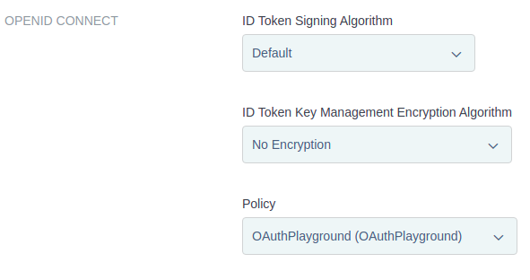
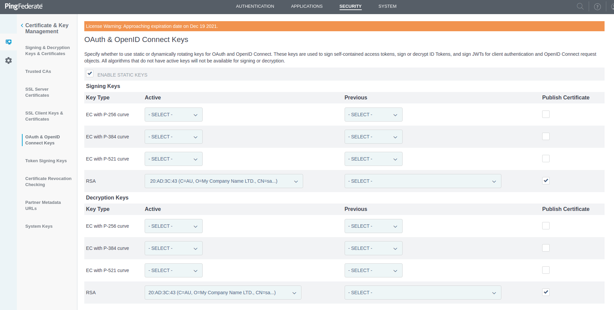

# Ping Identity Auth Playground

To be defined.

## Notes

### Callback during the authorization code grant type

Whe you are on Ping Identity, you must use [HTTPS](https://docs.pingidentity.com/bundle/developer/page/yhk1601508082481.html). You won't be able to use HTTP for development sadly.

### PingOne SSO is so simple that you'll probably need PingFederate

If you go with the [Try Ping](https://www.pingidentity.com/en/try-ping.html) and check PingOne SSO out, you're going to notice many limitations. First, you change its UI but in a limited manner. You are not able to insert a script of yours in JavaScript, let's say. In more complicated scenarios where you must do more steps for registration (I don't like that, but let's suppose this), you cannot change how PingOne SSO behaves. Another situation is when you'd like to allow your user to authenticate through username, email, and SMS, but the last two are passwordless. This is not supported, sadly. Only PingFederate supports these.

### I don't know why, but if you'd like to test PingFederate, you won't be able to do it on Ping Cloud promptly

When you create an environment on Ping Cloud with PingFederate, Ping asks you to run one using Docker, or you can ask the company to deploy it for you on Ping Cloud. Why is it so difficult? I don't know, but you won't be able to because you're going to need a license. You can create a [DevOps Account](https://devops.pingidentity.com/get-started/devopsRegistration/). After you do it, you're going to receive a Compose file, but it has errors. Use [this one](./docker-compose.yaml) preferably, and you should be good to go!

### If you only need authentication, you will probably need just PingFederate and PingDirectory.

PingFederate has [many features](https://www.pingidentity.com/en/resources/client-library/data-sheets/pingfederate-data-sheet.html), but it does not store users at all; for that, you're going to need a database. PingDirectory is the recommended product provided by them for that, and it's [LDAP compliant](https://www.pingidentity.com/en/resources/client-library/data-sheets/3196-pingdirectory-data-sheet.html). So technically, you can use an Azure AD rather than PingDirectory.

### {JWKError}Incorrect key type. Expected: 'RSA', Received: EC / Expected: 'oct', Received: EC / Key must be 256 bit for alg A256KW

Using the default configuration from PingFederate and the setup provided by [OAuth Playground](https://docs.pingidentity.com/bundle/pingfederate-103/page/lco1625223221631.html), I used the App Client `ac_oic_client` for Authorization Code grant type, but I got many errors like `Expected: 'oct', Received: EC` when trying to [decode the `id_token`](https://github.com/willianantunes/ping-identity-auth-playground/blob/b8caf4b7d9da5f651e286af6fb3dc4dacc4bd69e/ping_identity_auth_playground/apps/core/services/oidc_provider.py#L143-L145). To fix it, I followed the document [Configure static signing keys](https://docs.pingidentity.com/bundle/pingfederate-93/page/iak1564002985415.html) in order to create an `RSA` key type in _OAuth & OpenID Connect Keys_. Sample pictures to guide you through it:

### How to make SSO work by default

SSO does not work with a fresh version of PingFederate. I was using the OAuth Client `ac_oic_client` (the one that is automatically created by OAuth Playground Application). In order to make SSO works as expected, I followed [this documentation](https://docs.pingidentity.com/bundle/pingfederate-93/page/pmr1564002990528.html). In _AUTHENTICATION SESSIONS_ part, you have the checkbox ENABLE _AUTHENTICATION SESSIONS FOR ALL SOURCES_. Just activate it and SSO will work as expected. PingFederate will ask you all the time about the consent of the scopes, even though you had consented previously. Another issue that I'm trying to fix/configure properly. 

## Links

Projects:

- [pingidentity/pingone-sample-registration](https://github.com/pingidentity/pingone-sample-registration)
- [pingidentity/pingid-python-samples](https://github.com/pingidentity/pingid-python-samples)
- [pingidentity/pf-authn-js-widget](https://github.com/pingidentity/pf-authn-js-widget)

Guides:

- [Sample applications](https://apidocs.pingidentity.com/pingone/devguide/v1/api/#sample-applications)
- [Setting up a custom domain on PingOne](https://docs.pingidentity.com/bundle/pingone/page/cxs1575407884833.html)

Explanations:

- [What is PingOne SSO](https://docs.pingidentity.com/bundle/pingone/page/gbj1632772285136.html)
- [Introduction to PingOne](https://docs.pingidentity.com/bundle/pingone/page/als1564020488261.html)
